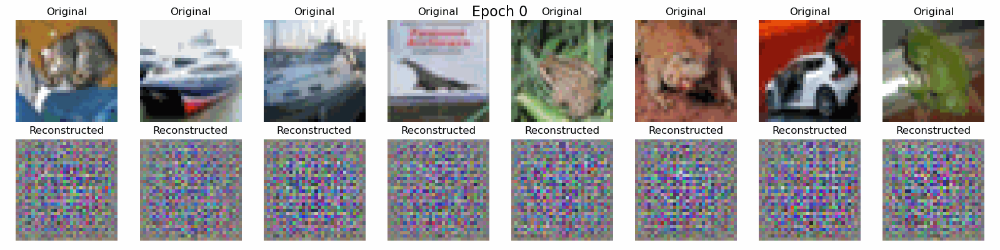

# Variational Autoencoder (VAE) for CIFAR-10

This repository contains a PyTorch implementation of a Variational Autoencoder (VAE) trained on the CIFAR-10 dataset. The code is structured to be clear, well-documented, and educational.

## Visualization of Model Convergence



**The animation above is included for pedagogical purposes.** It shows the progressive improvement of the VAE's reconstruction capabilities during training. The top row displays original images from the CIFAR-10 dataset, while the bottom row shows the corresponding reconstructions produced by the VAE at different training epochs. This visualization is invaluable for understanding how VAEs learn to compress and reconstruct data over time.

*This animation was created using the `create_gif.py` script in this repository, which combines individual frame images showing reconstructions from epoch 0 (untrained model) through epoch 12. The stark difference between the initial random reconstructions and the final results highlights the learning process.*

## What is a VAE?

A Variational Autoencoder (VAE) is a type of generative model that learns to encode data into a latent space distribution and decode samples from that distribution back into data. Unlike regular autoencoders, VAEs model the latent space as a probability distribution, which allows for generating new data by sampling from this distribution.

VAEs consist of two main components:
1. **Encoder**: Maps input data to parameters (mean and variance) of a probability distribution in latent space.
2. **Decoder**: Maps points from the latent space back to the data space.

The key innovation is the use of a "reparameterization trick" that allows the model to be trained with backpropagation despite the sampling process.

## Theoretical Background

The VAE optimizes two objectives:
1. **Reconstruction Loss**: Ensures the decoded data is similar to the input data.
2. **KL Divergence**: Forces the learned latent distribution to be close to a standard normal distribution.

The overall loss function is:
```
Loss = Reconstruction Loss + β * KL Divergence
```

Where β is a hyperparameter that controls the trade-off between reconstruction quality and the structure of the latent space.
The hyperparameters can be fine-tuned using, for example, a Bayesian optimization framework

## Implementation Details

Our implementation includes:

### Architecture
- **Encoder**: A series of convolutional layers followed by batch normalization and ReLU activations, with two fully connected layers at the end for the mean and log variance.
- **Decoder**: Mirror of the encoder, with transposed convolutions to upsample from the latent vector back to the input dimensions.

### Training Process
- We use the Adam optimizer with a learning rate of 1e-3.
- The CIFAR-10 dataset is used, which contains 60,000 32x32 color images across 10 classes.
- Training includes monitoring of both the reconstruction loss and KL divergence components.

### Visualization
- Reconstruction comparison between original and reconstructed images
- Random samples generated from the latent space
- 2D visualization of the latent space using t-SNE or PCA
- Interpolation between samples in the latent space
- **Progressive reconstruction visualization**: The included animation shows how reconstructions improve throughout training, which is essential for understanding the learning dynamics of VAEs.

## Installation

```bash
# Clone the repository
git clone https://github.com/MarouaneAEF/VAE-paper-with-animation.git
cd VAE-paper-with-animation

# Install requirements
pip install -r requirements.txt
```

## Usage

To train the model with default parameters:

```bash
python main.py
```

You can customize training with various parameters:

```bash
python main.py --batch_size 64 --epochs 100 --lr 0.001 --latent_dim 64 --beta 1.0
```

### Parameters

- `--batch_size`: Size of the training batch (default: 64)
- `--epochs`: Number of training epochs (default: 10)
- `--lr`: Learning rate (default: 1e-3)
- `--latent_dim`: Dimensionality of the latent space (default: 128)
- `--beta`: Weight of the KL divergence term (default: 1.0)
- `--save_path`: Path to save the trained model (default: 'vae_cifar10.pth')
- `--device`: Device to train on (default: 'cuda' if available, otherwise 'cpu')
- `--reconstruction_interval`: Save reconstruction images every N epochs (default: 1)
- `--video_fps`: Frames per second for the reconstruction progress video (default: 2)

### Generating the Reconstruction Progress Animation

The repository includes a script to generate the reconstruction progress animation from individual frame images:

```bash
python create_gif.py
```

This script will:
1. Read all PNG files in the `reconstruction_frames/` directory
2. Sort them by epoch number
3. Combine them into a GIF animation at 2 frames per second
4. Save the result as `reconstruction_progress.gif`

The current animation includes 100 frames, starting from epoch 0 (untrained model) through epoch 100 (trained model), showing the complete learning progression of the VAE.

You can customize this process by modifying the parameters in the script.

## Results

During and after training, the model will generate:

- Loss curves showing training and validation loss over time
- Reconstructed images at regular intervals to show learning progress
- Generated samples from random points in the latent space
- Visualization of the latent space structure
- An animation demonstrating the progressive improvement of reconstructions for educational purposes

## Files Organization

- `main.py`: Main script for training and evaluating the VAE
- `vae_model.py`: Implementation of the VAE architecture and loss function
- `utils.py`: Utility functions for visualization and data processing
- `create_gif.py`: Script to generate the reconstruction progress GIF from individual frames
- `requirements.txt`: Required Python packages
- `reconstruction_frames/`: Contains frame images from epochs 0-12 showing the progression of reconstruction quality
- `reconstruction_progress.gif`: Animation showing the complete learning progression of the VAE from untrained (epoch 0) to trained (epoch 12)

## References

1. Kingma, D. P., & Welling, M. (2013). Auto-encoding variational bayes. arXiv preprint arXiv:1312.6114.
2. Doersch, C. (2016). Tutorial on variational autoencoders. arXiv preprint arXiv:1606.05908.

## License

MIT 